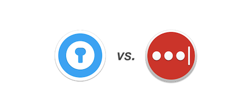
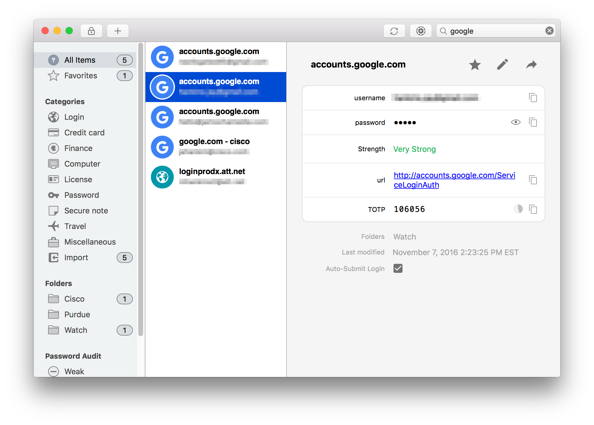

Earlier this year, I posted a overview of the [tools](/tools) that I use to make my life easier. In that post, I recommended [LastPass][lastpass], but recently I have switched away from it in favor of [Enpass][enpass], which has proven its worth to me over the past few weeks I've tried it.

[lastpass]: https://lastpass.com
[enpass]: https://enpass.io

--- 

## LastPass
[LastPass][lastpass] made headlines earlier this month by announcing that it is completely free to use across multiple devices (supported by ads). Previously, I was a LastPass Premium subscriber so my passwords would sync between two Macs and my iPhone. Other premium features include:

* No advertisements 
* Password sharing with up to five family members
* Yubikey two-factor authentication 
* 1 GB of file storage

  
When you look at LastPass's feature-set, especially now that mobile sync is free, it's underwhelming. Couple that with a clunky interface that has only gotten worse in recent years, and you might be interested in finding a new password manager. Enter Enpass.

## Enpass

[Enpass][enpass] is a relative newcomer to the password management scene. 
Enpass's earliest blog posts are from early 2014, so it has had about 2.5 years to mature. It supports a wide array of platforms, including BlackBerry and Universal Windows. It also has browser extensions for password saving, retrieval, and generation. 

Some of my favorite features include:

* One time password support - If an online service you use has two-factor authentication using one time passwords, Enpass has OTP support built in. One fewer app to open to login to a website saves me time.
* Apple Watch support - Enpass supports both Apple Watch and Android Wear devices to display one time passwords right on the device. Nice!
* Beautiful interface - if you're on a Mac, this is especially true. The app looks at home on an Apple product in a way that LastPass never has.
* Cloud sync - you can pick where to sync your passwords. All of Enpass's data goes into an encrypted file that can be synced with Dropbox, Google Drive, iCloud etc.
* No subscription - you can use the desktop app completely free, and if you want passwords on your mobile device, you can sync up to 20 items for free, or an unlimited number of items unlocked via a one-time in-app purchase.
* Import - you can import from a number of other password managers, including LastPass.

---
For the time being, Enpass is my password manager of choice. The interface is slick and offers some handy shortcuts that have since become an integral part of my workflow. My passwords are always backed up in the cloud, so I'm not worried about losing any passwords. At the end of the day, the user interface wins me over. Enpass looks like it belongs on my devices, where LastPass's design always felt like an afterthought.

What password manager do you use? Are you considering a switch? Let's discuss in the comments or [@jay_hankins](https://twitter.com/jay_hankins).
