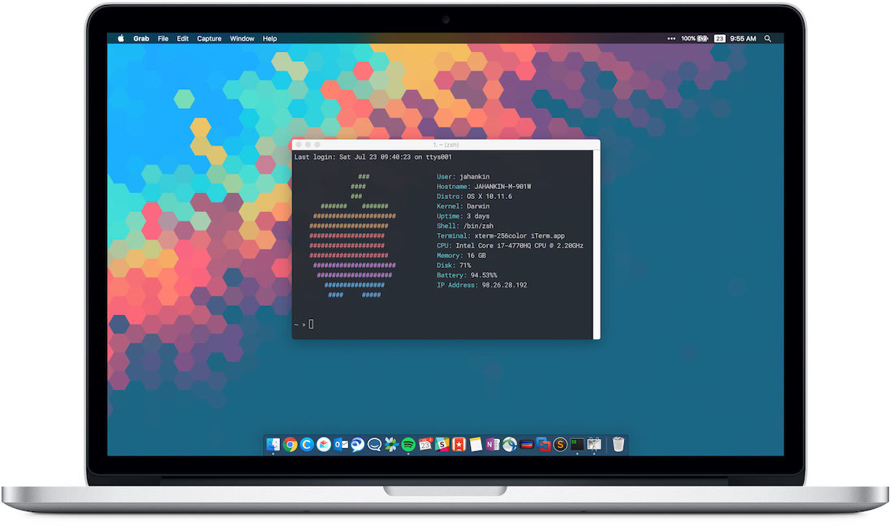
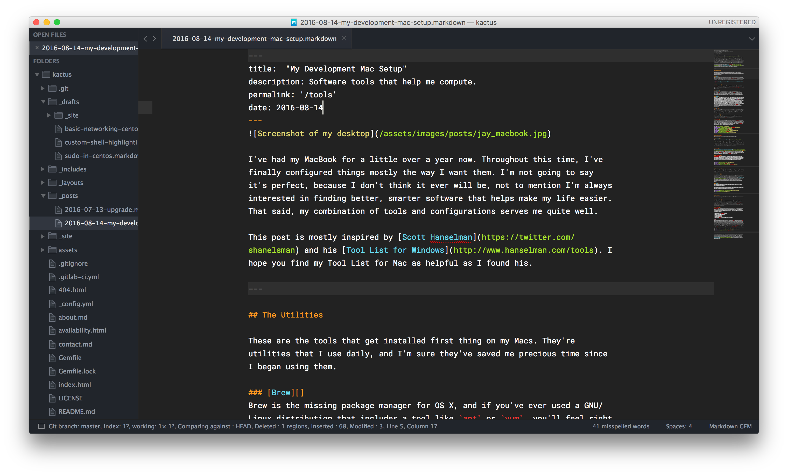
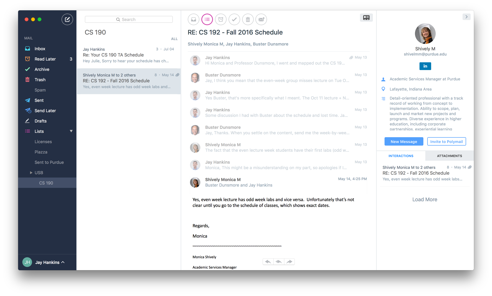

I've had my MacBook for a little over a year now. Throughout this time, I've finally configured things mostly the way I want them. I'm not going to say it's perfect, because I don't think it ever will be, not to mention I'm always interested in finding better, smarter software that helps make my life easier. That said, my combination of tools and configurations serves me quite well.

This post is mostly inspired by [Scott Hanselman](https://twitter.com/shanelsman) and his [Tool List for Windows](http://www.hanselman.com/tools). I hope you find my Tool List for Mac as helpful as I found his.

---

## The Utilities

These are the tools that get installed first thing on my Macs. They're utilities that I use daily, and I'm sure they've saved me precious time since I began using them.

### [Brew][]

Brew is the missing package manager for OS X, and if you've ever used a GNU/Linux distribution that includes a tool like `apt` or `yum`, you'll feel right at home. It's the niftiest way to install command line utilities on your Mac.

> **Tip**: install newer versions of the programs that are included with OS X. `vim` comes to mind.

### [Homebrew Cask][]

Homebrew Cask is an extension of `brew` that enables installation of GUI programs. Need to install Google Chrome? `brew cask install google-chrome` and you're done.

### [iTerm 2][]

iTerm 2 is a terminal emulator for OS X that replaces the built-in Terminal.app. With features like profiles, panes, `tmux` integration, and more, you'll love the additions it has over the built-in terminal. If you spend any time in a terminal, iTerm 2 is worth your precious storage space.

### [aText][]

aText is a "typing accelerator" for your Mac. Basically, it is a text expander that watches your keystrokes for certain abbreviations and replaces them with fully featured text. For instance, I've set "&shrug" to "¯\\\_(ツ)\_/¯". I wonder why I wasted so much time without a text expander utility before. This one is inexpensive (\$4.99) and flexible. A big standout feature is that it works in any program, including terminal emulators. I previously used the built-in "Text Shortcuts" in Mac OS X, but they only work in applications that use Apple's text entry framework. This limits it to a few apps, and specifically Text Shortcuts do not work in Chrome, which really makes it a non-starter.

### [f.lux][]

F.lux is essential if you use your computer at night. It dials the blue light of your display down so that disruption to your circadian rhythm is minimal. If you've got an iOS device, it's a lot like "Night Shift". This one is for Mac, Windows, Linux, and (rooted) Android.

### [Spectacle][]

This simple utility allows you to move and resize application windows with keyboard shortcuts. Windows Aero Snap meets Mac OS X.

### [Dropbox][]

There are lots of cloud storage providers out there, but Dropbox continues to be my top choice because it's so unobtrusive. It's on every platform, and I've never run into a single issue with it. In fact, it's saved my bacon more than once. If you're on Windows you might be happy with OneDrive, but Dropbox is still worth a look if you use multiple platforms.

[brew]: http://brew.sh/ 'Brew Website'
[homebrew cask]: https://caskroom.github.io/ 'Homebrew Cask Website'
[iterm 2]: https://iterm2.com 'iTerm 2 Website'
[f.lux]: https://justgetflux.com 'f.lux Website'
[spectacle]: https://www.spectacleapp.com/ 'Spectacle Website'
[dropbox]: https://dropbox.com 'Dropbox Website'
[atext]: https://www.trankynam.com/atext/ 'aText Website'

## The Security Apps

These are just a few security utilities that I find useful.

### [LastPass][]

[You should be using a password manager.](http://www.wired.com/2016/01/you-need-a-password-manager/) LastPass is my choice because it's inexpensive and works with all the platforms I use. (Be on the lookout for discounts, students). Yes, you could install just the browser extension, but I find the ⌘ + Shift + L keyboard shortcut for searching the vault too valuable to give up (it's like Spotlight search but for your LastPass vault).

### [Authy][]

[You should be using two factor authentication.](http://lifehacker.com/5938565/heres-everywhere-you-should-enable-two-factor-authentication-right-now) Authy is a great authenticator app primarily because of its built-in cloud backup/sync. It has apps for Chrome, iOS, and Android, so if you use multiple devices and need to keep your tokens in sync, Authy is your best bet.

### [Tunnelblick][]

Tunnelblick is a GUI wrapper for OpenVPN on OS X. OpenVPN is the best open source SSL VPN, and it's a protocol of choice for lots of VPN providers. This is one of the rare times I recommend using a third-party application over the OS X built-in, but the added security OpenVPN offers makes it worth it.

[lastpass]: https://lastpass.com 'LastPass Website'
[authy]: https://authy.com 'Authy Website'
[tunnelblick]: https://tunnelblick.net/ 'Tunnelblick Website'

---

## The Development Tools

These are tools that help me develop. This list can change pretty drastically depending on the type of project or language, but my stalwart software is as follows.

### [SublimeText][]

SublimeText is a quintessential text editor for Windows, Mac OS X, and Linux. I love it for its blazing speed. Not only does it have lots of built-in awesomeness, but it also has incredible extensibility through [Package Control](https://packagecontrol.io/). It's so versatile, in fact, that I used it to develop a full MEAN stack application in JavaScript while writing its documentation in Markdown. I also write these blog posts in SublimeText as well.

### [Vim][]

Although SublimeText is my main editor, sometimes you just have to use the terminal. Use Vim. The end.

This might seem like a short list, but if we're being language-agnostic, what more do you need to develop than a text editor? :-)

[sublimetext]: https://www.sublimetext.com/ 'SublimeText Website'
[vim]: http://www.vim.org/ 'Vim Website'

---

## The Basics

Nearing the end of the list, I want to list a couple tools that everyone uses, dev and non-dev alike.

### [Google Chrome][]

Yes, I use Chrome. I wish it were more battery-efficient, but I need its extension and multi-user functionalities. I try to keep my work at Cisco separate from my personal browsing, so I use Chrome's multi-signin feature daily. I haven't found another browser that makes it as easy to separate two identities as Chrome does.

### [Polymail][]

Polymail is a new mail client for OS X and iOS. It offers a modern look and modern functionality that tries to make email easier. I personally use its tracking and scheduling features the most. It's my winning mail client for a number of reasons:

- Good support for Gmail aliases
- Multi-account signatures
- Track sent emails
- Email scheduling
- Cloud sync app preferences between iOS and Mac.

I like that it handles the above in a standalone app, not as an extension (à la MixMax). I'm not going to lie, it's still rough around the edges. I'm not an email power user, so you may want to stick with something more capable if you are. That said, they've been adding features and making improvements at an impressive clip. Here's hoping they work out a couple instability issues. For the time being, I still find myself hopping back to Google Inbox on my iPhone and Gmail on my desktop, but I make more use of Polymail with each passing day.

[google chrome]: https://google.com/chrome 'Google Chrome Website'
[polymail]: https://polymail.io/ 'Polymail Website'

---

There's a brief overview of the tools I use. I'll continue to flesh out and modify this list, as my preferences are always changing! If you've got any questions about the software on this list, feel free to reach out to me [@jay_hankins](https://twitter.com/jay_hankins) and I'd be happy to chat with you about them.
