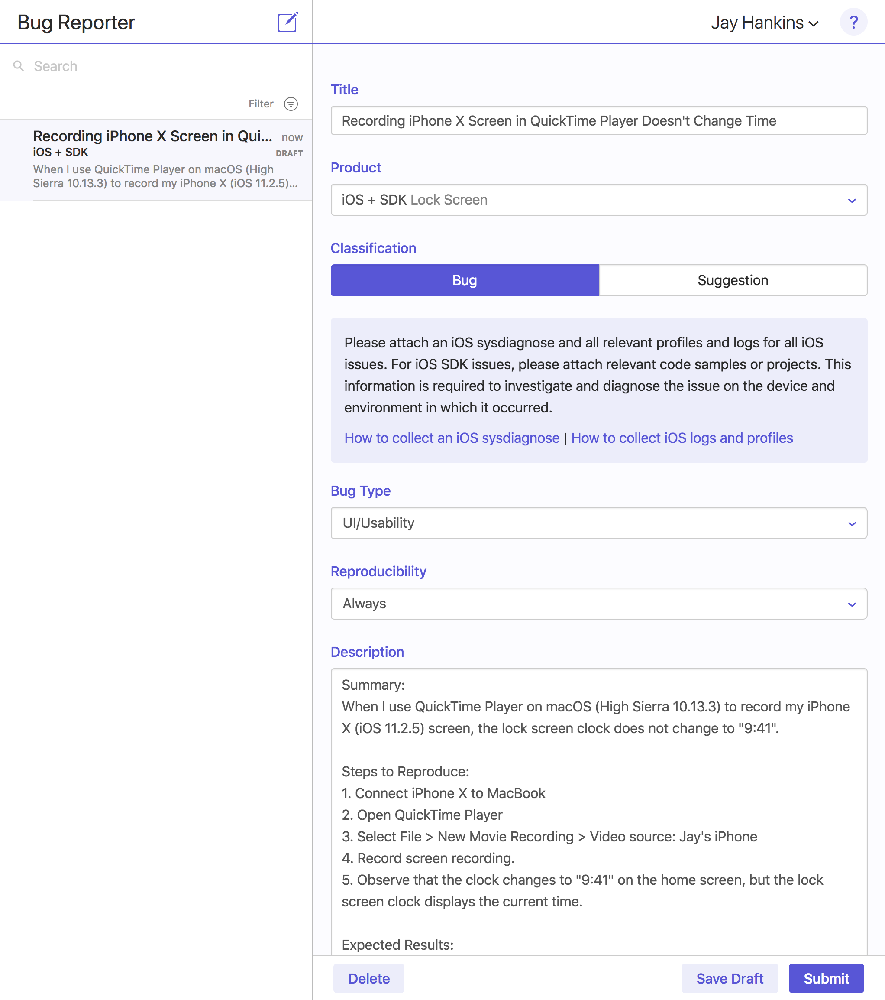
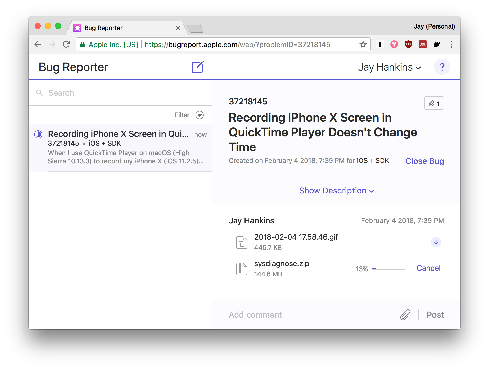
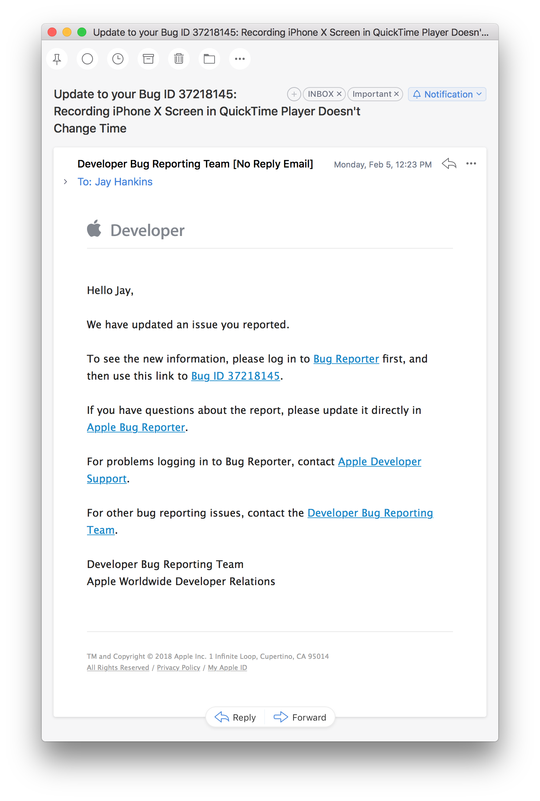
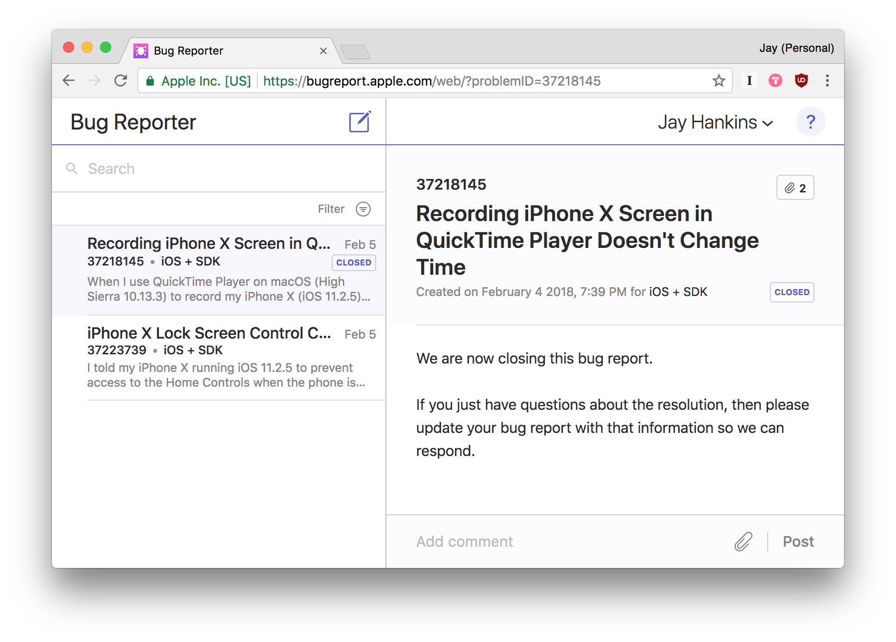

Lately I've been thinking that instead of just complaining about iOS, maybe I could do something to make it better.

I found two bugs in my new iPhone X. I'm not sure if they are iOS 11 bugs, iPhone X bugs, or FaceID bugs. Regardless, I thought it would be nice to document the process of bug reporting and the followup process. I've never reported a bug to Apple before... Let's see what happens!

## The Issue
With a Mac and iOS device, you can take a screen recording of your device through QuickTime Player. Just connect it to your MacBook and you can select it as a device in QuickTime.

 When your device is in this mode, the clock changes to "9:41". On my iPhone X, this only happens on the status bar clock and not on the lock screen, which continues to show the time of day. On previous versions of iOS, the lock screen clock changed as well.

Caption: 1:31 on the lock screen clock; 9:41 on the status bar.

## Letting Apple Know
Here's the bug report I filled out. It's important to be as verbose and specific as possible. When you include things like the software versions on the original bug report, it can be a big help for developers who track down the bugs.

Now as of 9:39 PM, 2/4/2018, I'm waiting to see what happens. Maybe there will be a response, maybe not. It's a low priority bug for sure. In fact, I only uncovered it because I wanted to record another bug. Regardless, if you've ever wondered how to report bugs with your favorite Apple products or services, this is a good way to do it!

### Update
##### 2/5/2018, 12:23PM EDT

The big update? "It is fine." - Apple

