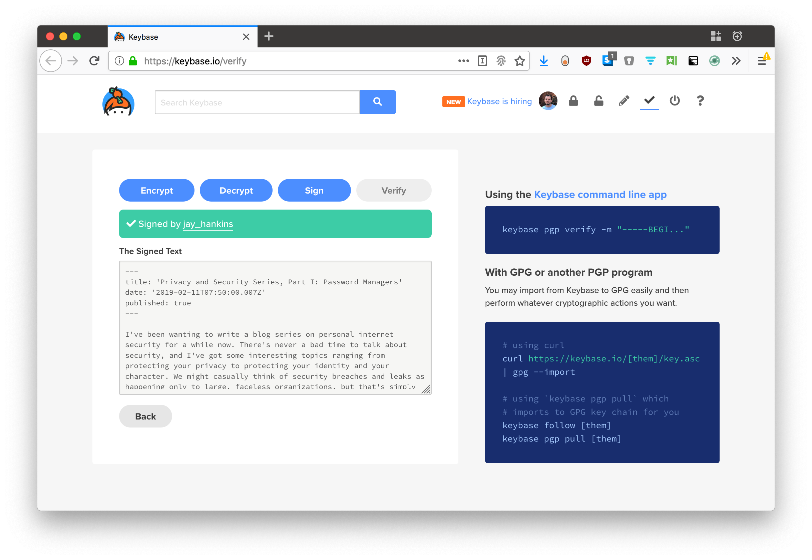

I purchased some Yubikeys a few weeks back, mostly for the convenience factor of
pushing a button to sign into different web services securely. Anyway, another
one of the cool things a Yubikey can do is store a PGP private key[^1]. You can
then use this PGP key to digitally sign code commits, emails, files, anything
really.

## Motivation

Without going too deep into PGP and its various uses, I thought it would be cool
to post digital signatures of every post/page I create on this site. Why? Well,
when I sign my content, it proves the following[^2]:

1. What you're reading is **what I wrote, and only what I wrote.**
2. What you're reading was written **by me, and only me.**
3. Basically, what you're reading has been unmodified.

Say an adversary wanted to take control of my site and make it look like I wrote
something I didn't actually write. (Realistically, it would take a large amount
of effort to even obtain write access to my site, because of my [random,
high-strength
passwords](../privacy-and-security-series-part-i-password-managers/) and 2FA.
But let's pretend I'm compromised on those fronts.)

Without PGP signatures, anyone who managed to write to my site's files could
claim I wrote something, whether or not I actually did. An adversary might make
an `i-hate-mexican-food.md` post file and then it would just look like I wrote
this horrible lie on my blog. I would have no way to deny the lie, no matter how
damning to character or livelihood.

With post signatures, creating new content requires a process initiated by me,
with my Yubikey plugged in and unlocked by my PIN. A signature confirms that me,
and **only me** wrote those, and **only those** words. If a post is unsigned, or
if the signature doesn't validate, you have no guarantee that I wrote it-- in
fact, it probably means I didn't.

In addition, signing means that no one can take words I wrote and claim them as
their own, and it means that I can't deny words I wrote in the future.

[^1]: Technically, the Yubikey operates a few protocols, one of which is [OpenPGP Card](https://openpgpcard.org/).
[^2]: As long as you trust that a) the private key I claim is actually mine; b) I keep my private key secure (which the Yubikey helps me do); and c) the PGP protocol is unbroken.

## How it Works

Here's how I set up semi-automatic post signing for my Gatsby blog. It works in
two parts. The first part is a lightweight Node script which locates all the
Markdown files in the `content/blog/` directory and calls out for `gpg` to sign
each one.

<video controls alt="screencast">
  <source src="signing.mp4" type="video/mp4">
</video>

### Build-end / Backend

Prerequisite assumptions:

1. You have a PGP keypair set up.
2. You have adquate knowledge with PGP tooling (namely, GPG and GPG Tools).
3. If you're using a Yubikey, you've set up GPG to use it.

The Node script looks like this-- It's actually my first little TypeScript
endeavor.

`embed:2019/pgp-signing-my-posts/sign-posts.typescript`

Basically, the `signFolder()` function tries to sign every `.md` file in the
`content/blog/` directory. It tries to locate `*.md.asc` files for every
corresponding post. If a post isn't signed, it calls out to `gpg` to sign it.

I added a script definition to my `package.json` as well. Now I can call `yarn sign` to begin the process of signing all posts without signatures.

```js
// package.json
"sign": "node utils/sign-posts.js",
```

### Frontend

I needed a component to render links pointing to each post's PGP signature file.
My posts would be hosted at GitHub, so it seems appropriate to put the
signatures there as well.

The newly-minted `PGPInfo` component uses the `slug` field generated by Gatsby
to determine the correct link for the post's signature and the source used to
generate it.

`embed:2019/pgp-signing-my-posts/PGPInfo.jsx`

I put the `PGPInfo` component into the `blog-post.js` file since I'm only
rendering it on posts at the moment.

Be sure to check out this
[commit](https://github.com/jay-hankins/jayhankins.me/commit/a089e38dd2379b05b3b6fc6cbab9b399f9d25ff7)
where both the front- and back-end code was first published for complete
details.

## Verifying the Signature

Here's how it looks on the frontend, to you, my dear readers! 

Just click the "View PGP Signature" link at the bottom of any post. You'll be
taken to a GitHub page with the full PGP message signature.

Now, copy that file's entire contents. It looks like junk, but it's not. You'll
see soon.

Head on over to [https://keybase.io/verify](https://keybase.io/verify). Keybase
is a company that provides "crypto for everyone" a.k.a. they've put some
convenient tooling and UI/UX work into crypto applications. I host my public key
there so that people can easily verify messages from me using their web
interface.

Paste the message signature that you copied and click **Verify**. If the
signature verifies, you'll see a success message, along with the plaintext copy
of the post (its source file).



How cool is that? All that junky looking cryptic text was actually the source
Markdown that makes up the post! Cryptography is one of those things that
seriously amazes me… it's [Computer
Magic](https://www.youtube.com/watch?v=CEyyM3KpVlw).

## How I'd Improve It

This was more or less a proof of concept. The assumptions make it brittle-
namely, every post now needs to be named `index.md` in a folder named as
`post-title-slug`. Not the worst thing, but it is a departure from my previous
setup. The script could be more robust and allow for more unique data structure.
I'm definitely not making full use of GraphQL with the current approach.

I might rethink this in the future, but for now it takes care of everything I
want it to. Anyone feeling really into the Gatsby ecosystem and wants to
yak-shave this into a plugin? I'll be your first customer! 😉
