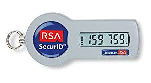
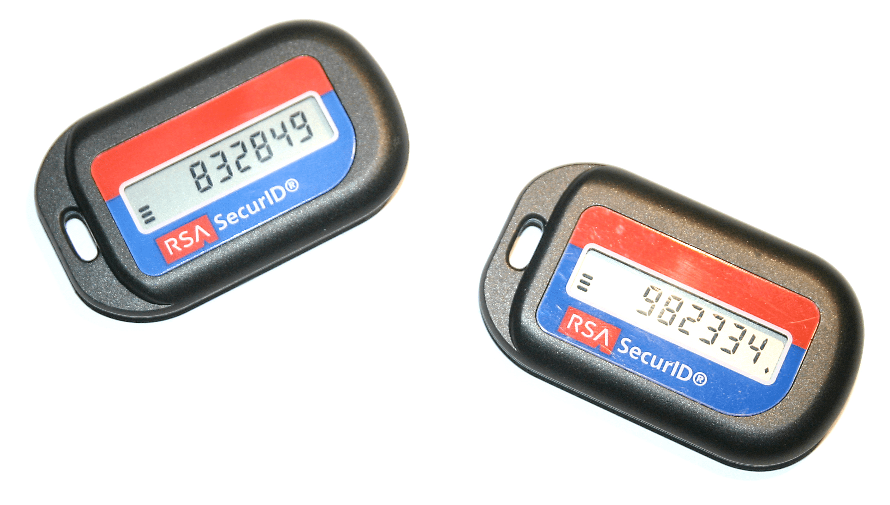
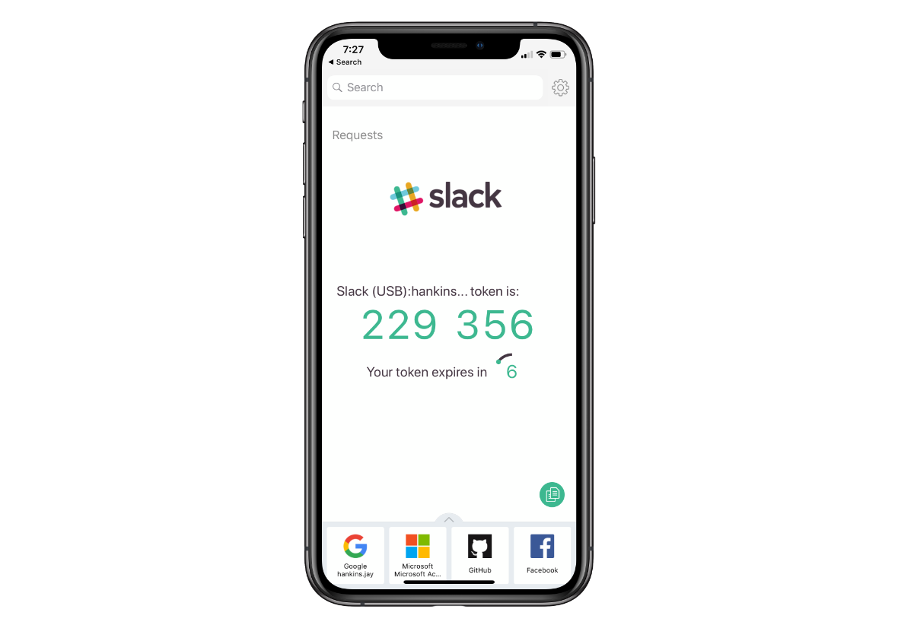
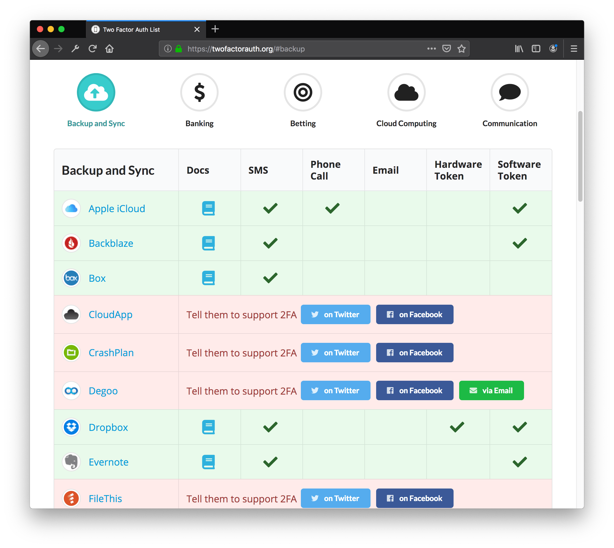

In the [last Privacy and Security Series
post](../privacy-and-security-series-part-i-password-managers/), I wrote about
the importance of password managers. In the face of data breaches and credential
dumps occurring nearly every day, you need a strategy to protect yourself.
Single-factor password authentication is weak, but password managers are a convenient tool to help you lock down your online accounts and localize
a breach so that one leaked credential doesn't give an attacker the "keys to the
kingdom". It's all about preventing access to your accounts, people.

By the way, in March news broke that 8fit had a data breach in July 2018. While
the breach happened in July, the credential list didn't appear for sale on the
dark web until February 2019. My credentials, along with about 15 million
others', were leaked. Thanks to [HaveIBeenPwned](https://haveibeenpwned.com), I
knew as soon as the experts did. If you didn't sign up for it the [last time I
mentioned it](../privacy-and-security-series-part-i-password-managers/), I again
recommend it.

In addition to adhering to password manager best practices, you can bring
another layer of security to your online accounts with multi-factor
authentication. Welcome to Part 2, all about multi-factor auth, why it's useful,
and how to set it up the right way.

## What is Multi-Factor Authentication (MFA)?

When a system needs to authenticate that you are who you say you are, it can use
a variety of factors, or pieces of information, to verify your identity. Many
systems just use one factor, like a single password.

Multi-factor Authentication is authentication that relies on more than one
factor to verify you. Many things might be factors: security questions, one-time
passwords, a PIN, etc. For example, a common multi-factor authentication scheme
that you see with major U.S. bank websites involves both a password and a
one-time passcode sent to your cellphone. Or, as Wikipedia points out:

> A good example of two-factor authentication is the withdrawing of money from
> an ATM; only the correct combination of a bank card (something the user
> possesses) and a PIN (something the user knows) allows the transaction to be
> carried out.

Multi-factor auth strategies are becoming more and more common. Two-factor
authentication (2FA) usually involves a password (factor #1) and a token code
(factor #2). The 2FA strategy is sometimes referred to as "something you know
(the _password_) and something you have (the _token_)."

2FA has actually been around for a while, especially in enterprise and
government. Many folks will have used or at least seen an [RSA
SecurID](https://en.m.wikipedia.org/wiki/RSA_SecurID), which is probably the
single best-selling hardware token for 2FA. [^1] [^2]

<figure>
  
  <figcaption>RSA SecureID is a popular brand of hardware token.</figcaption>
</figure>

<figure>
  
  <figcaption>Authy is a popular authenticator app which functions as a software token and a push authenticator.</figcaption>
</figure>

### Why Use MFA?

Basically, the strength of multi-factor auth is that it gives you an extra layer
of security on top of passwords. More generally, MFA protects you when one of
your factors is compromised.

Say you only use a username/password combination to log into your Google/Gmail
Account. That's one factor, the password. If it's leaked, **100%** of the
authentication factors are compromised. Your account is hacked.

**But**, if you use MFA, and the password is leaked, only **50%** of the auth
factors are compromised. The second factor is still unknown or unavailable to
the attacker. For example, if your second authenticator is your (unhacked)
smartphone, and it's in your pocket, the attacker won't have all the factors and
won't get in. Your account is safe.

MFA is _especially_ useful for those pesky websites that have password length or
character limitations. We [all
know](../privacy-and-security-series-part-i-password-managers/) that
`Correct.horse-battery$Staple` is a better password than `M@nc#3$ter`... but for
those sites that only support 16 characters [A-z1-9], a second authentication
factor will drastically increase your security.

## How to Set Up MFA

Hopefully I have you convinced that MFA is important... the next step is to set
this up for yourself. Luckily, we aren't the only ones who have realized the
benefit to MFA. Major online service providers are now 2/MFA enabled, and you've
probably been prompted to set it up before.

Probably the first thing you'll need to do is choose a MFA token type. You can
choose one or many, depending on your wants and needs.

### Types of MFA Tokens

- **SMS** - Text messaging is on the list first _not_ because it is the most
  secure, but because it's the most popular. Many, many websites now offer SMS
  one-time passwords, and unfortunately it's sometimes all they offer. However,
  SMS one-time passwords are better than nothing!
- **Software Token** - Software that generates one-time-passwords based on a
  cryptographic function of time and a token secret, which is given to you by
  the service provider when you set up 2FA. Most commonly you see TOTP
  (Time-based One-Time Password) generators. When you set up an authenticator
  app with a secret code or a QR code, you are using a TOTP software token.
- **Hardware Token** - There are a variety of hardware tokens. Some are OTP
  generators with a button press to generate codes, and others like the RSA
  token are always-on and cycle through a number of TOTP codes.
- **Push Authentication** - Push authentication is an MFA factor popularized by
  Duo, Authy, and Google. Basically, a push notification is sent to your
  smartphone and you approve or deny the request via the respective app. For
  example, Google can send Push Authentication notifications to any iOS device
  with the Gmail or Google apps installed.
- **And More** - Yubikeys are a popular type of hardware token. They have
  multiple modes of operation, including TOTP, U2F, Fido, and other choice
  protocols, but also a specialized Yubico code which is based off the key's
  serial number, and a PIV mode for smart card protocols. Another app, called
  Krypton, emulates a hardware U2F key and can support MFA for SSH logins.

**_What's wrong with SMS?_** SMS is the most popular, but probably weakest form
of MFA. This is because it's relatively easy for an attacker to convince your
cell phone carrier that they are you, and the carrier will provision them a new
SIM card, and from then on it is the attacker who receives your SMS one time
passwords. I quickly Googled and found
[two](https://medium.com/@CodyBrown/how-to-lose-8k-worth-of-bitcoin-in-15-minutes-with-verizon-and-coinbase-com-ba75fb8d0bac)
[cases](https://medium.com/coinmonks/the-most-expensive-lesson-of-my-life-details-of-sim-port-hack-35de11517124)
where cell phone carriers were the weak link and allowed an unauthorized user to
get a SIM card for your account. I recommend reading the two posts for full
details.

## Where to Set Up MFA

Ideally, you'll set up 2FA everywhere! That said, you should enable 2FA on these
at a minimum:

- your webmail
- financial sites
- healthcare/insurance sites
- social media accounts

The first is obvious, I hope. If an attacker gets your email credentials, you're
pretty much done for. That's because your email can probably be used to receive
password reset emails for all your other accounts.

Financial, healthcare, and insurance sites all hold a variety of sensitive data
and breaches to those accounts can have material impacts on your life very
quickly. It's best to multi-factor those for extra peace of mind.

Finally, I think it's important that social media accounts be protected by MFA.
It could be incredibly damaging for someone to hack your social media account
and make false claims about you. Your character could be damaged, so I consider
social media to be a high-risk environment needing extra security.

Here's a great resource for knowing which online services support MFA:
https://twofactorauth.org/. I recommend going through every service in the list
and enabling 2FA for all that you have.

PCMag (hey, remember them? used to love that magazine) has a very thorough
article on [how to set up 2FA for over 30 different online
services](https://www.pcmag.com/feature/358289/two-factor-authentication-who-has-it-and-how-to-set-it-up).

## FAQs

1. **Do you recommend a specific 2FA authenticator app?**

   No, I find them all to be about the same. I always prefer U2F or push
   notification authorization to TOTP apps (like Google Authenticator), but I
   use Authy for services where that's the only option.

2. **Isn't this a bit inconvenient?**

   What's more inconvenient, having to key in 2FA codes or having your accounts
   stolen from you? Keying in MFA codes a few times a (week/day/hour) is worth
   it because of how much more secure the practice can make your accounts.

3. **What about logging into applications?**

   This is a bit of a caveat. Modern applications that use OAUTH2 for logging
   into web services will typically **not** need any special treatment.
   Actually, they are secured through the online service's MFA login. For
   example, adding a Gmail account to an iPhone loads a Google login flow page.

   Other, older applications might need a statically generated password that
   bypasses the MFA login flow. For example, using Gmail over the IMAP protocol
   will need what Google calls an "application password".

   You'll have to check with your online service to find out how to handle each
   situation, but generally speaking, if you can't access the login provider's
   page, (e.g. the Google login flow) and are keying credentials into form
   fields in the application, you will need to obtain a static password.

4. **Why is SMS 2FA bad?**

   Generally speaking, SMS 2FA is fine. I'm not sure about the security of the
   SMS protocol, but I mean it's probably safe to bet that various government
   agencies could intercept your SMS codes. Do they want to? Probably not, but I
   don't know what my readers are getting up to.

   The bigger danger is from your cell phone carrier itself- it seems that it's
   fairly easy for an attacker to socially engineer their way into obtaining a
   SIM card for _your_ account. Then, suddenly, text messages meant for you are
   going to their phone, and they can get those SMS 2FA codes.

   Make sure you've taken security seriously with your cell phone carrier. Avoid
   using real answers to the security questions, and make sure you have any
   locks turned on. Some carriers allow you to set a passphrase or PIN which
   would be required to process any changes on the account.

5. **What happens if I lose my token (or phone)?**

   Unfortunately, there aren't easy answers to this. The harder you make it for
   attackers to get into your account, the harder it will be for you to get into
   your account if you ever lose an authentication factor.

   When you enable 2FA with online services, they will typically provide you
   backup codes to print and store for safekeeping. It's very important to keep
   these backup codes, else you may not have other ways to get in.

   My personal strategy includes having additional Yubikeys in safe locations in
   the (unlikely, I hope) event that lose my primary authenticators.

6. **What are some other advantages and disadvantages of using mobile phones as
   authentication tokens?**

   Mobile phones are a great way to get started with two-factor authentication,
   either by SMS or a TOTP authenticator app. Authenticator apps are better
   typically. Wikipedia has a great
   [section](https://en.m.wikipedia.org/wiki/Multi-factor_authentication#Use_of_mobile_phones)
   on the advantages and disadvantages. **tl;dr:** phones may not be a great
   option if your data connection isn't solid, and SMS delivery can be flaky
   in general. TOTP authenticator apps overcome this since the OTP is generated
   on-device.

## Next Time

And... that's about it! Thanks for reading Part II. There's more we could say
about multi-factor auth, and we will! In Part III, we'll talk about advanced
multi-factor strategies focused primarily on Yubikey. (Spoiler: I started
writing this article before acquiring Yubikeys...) You think we're secure? You
ain't seen nothing yet.

[^1]:

  I'm not particularly interested in looking up whether this is true or not, all
  I know is that SecurIDs were and are everywhere. My mom had one in the late
  90s/early 2000s and she didn't work in tech, so it's not like 2FA is a recent
  or nerdy development. (Does anyone have a picture of the credit card-sized RSA
  token from back then? I can't quite remember what it looks like, but I think
  it was white... I'm dying to see a picture for nostalgia's sake.)

[^2]:

  Did you know that SecurID systems used to have the concept of a "duress PIN"?
  This was a PIN that provided access but also silently logged a message for the
  sysadmin to know that the user was forced to authenticate.

  > On older versions of SecurID, a "duress PIN" may be used—an alternate code
  > which creates a security event log showing that a user was forced to enter
  > their PIN, while still providing transparent authentication. Using the
  > duress PIN would allow one successful authentication, after which the token
  > will automatically be disabled. The "duress PIN" feature has been deprecated
  > and is not available on currently supported versions.

  Imagine the situation that caused the invention of that feature! Truly a
  gun-to-head scenario.
