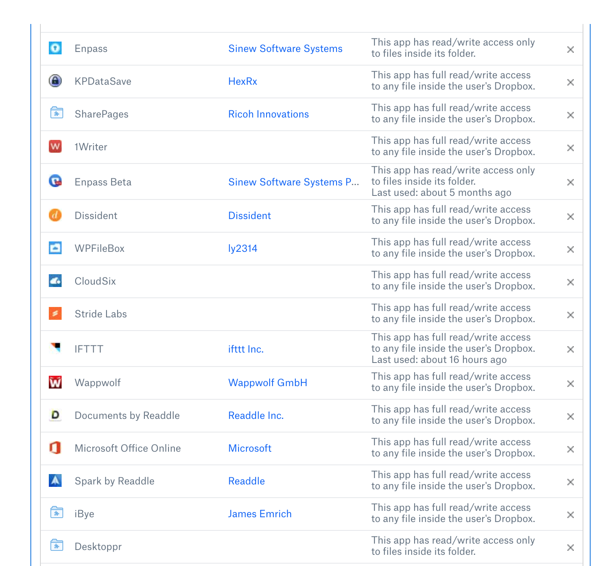
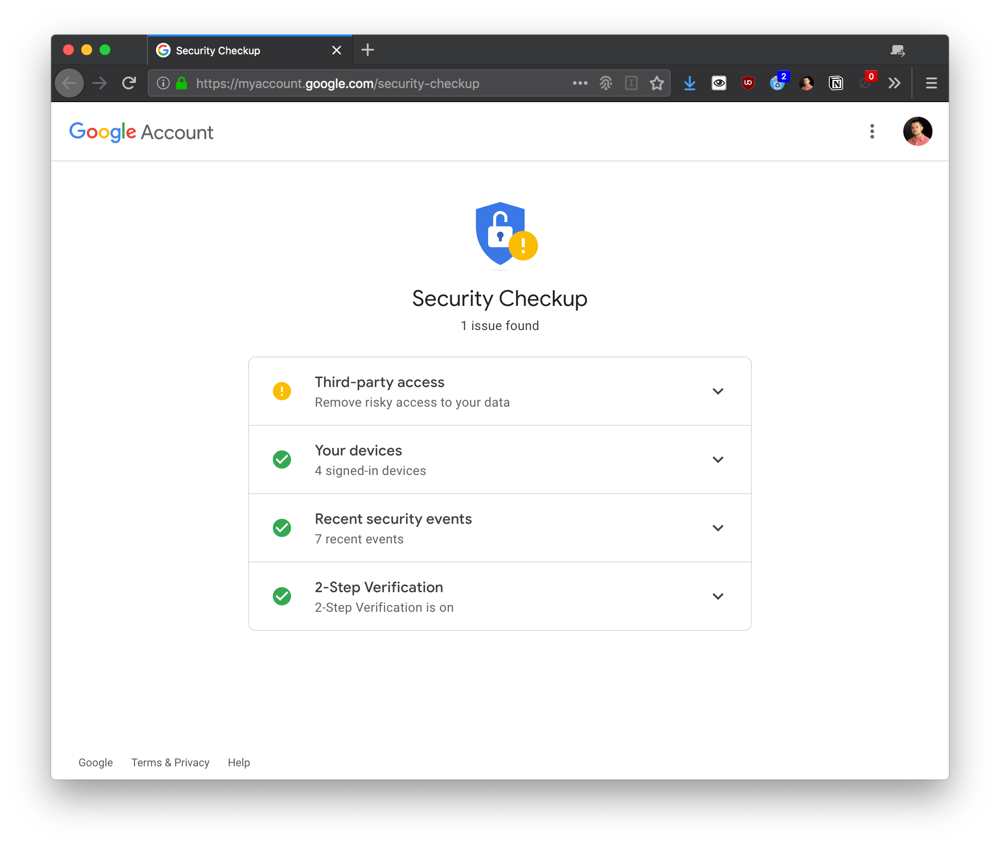

In the last Privacy and Security Series [post](../privacy-and-security-series-part-ii-multi-factor-auth/), we talked about the
importance of multi-factor authentication (MFA), also known as two-factor
authentication (2FA). Enabling MFA is a giant leap forward when it comes to
securing your online accounts — [Google and Microsoft both say that enabling MFA
blocks 99.9% of account
hacks](https://www.zdnet.com/article/microsoft-using-multi-factor-authentication-blocks-99-9-of-account-hacks/).

> If hackers are germs, MFA is the Purell of internet account security.

So, you've followed the password best practices we talked about, and you have a
password manager, and you've enabled MFA on your accounts. Is there more you can
do? **Yes, of course!**

## Going Farther with Two Factor Authentication

Last week, Square & Twitter CEO Jack Dorsey had his [Twitter account
compromised](https://www.wired.com/story/jack-dorsey-twitter-hacked/) by a
SIM-swap attack. Long story short, a fraudster was able to convince someone
working for AT&T to swap Jack's phone number to the fraudulent SIM, which was
used to send Tweets via SMS.

**Why does a [SIM-swapping
attack](https://krebsonsecurity.com/tag/sim-swapping/) matter to you?**

Well, if your MFA strategy is to have a one-time-password texted to your phone,
you are vulnerable to a SIM-swap. Technically, anyone with a cellular device is
vulnerable, but accounts backed by SMS-OTP MFA are vulnerable in particular.

**Are there other downsides to SMS one-time-passwords?**

Yeah, quite a few actually. As of July 2016, the U.S. National Institute of
Standards and Technology (NIST) [said to stop using
them](https://blog.identityautomation.com/two-factor-authentication-2fa-explained-email-and-sms-otps).
I discuss some additional downsides in the previous post.

**What's a better alternative to SMS-OTPs?**

- Token-based OTPs (time-based OTPs)
  - Is not vulnerable to the SIM-swapping attack because each one-time-password
    is generated by a seed/token value. So long as
      1. the seed is not intercepted (which you can be reasonably sure of, if
         you trust the security of HTTPS/TLS and the root Certificate
         Authorities); and
      2. your OTP device is secure you are much more secure than with an
         SMS-based OTP.

- U2F / Yubikey / Other smartcard / certificate authentication
  - Some companies, like Google, are supporting the FIDO/U2F/Yubikey approach,
    which involves the exchange of public keys to be matched with the private
    half of the keypair stored on secured hardware devices. So long as
      1. As long as no one steals your U2F device; and
      2. the encryption isn't cracked

      you are even more secure than with Token-based OTPs, as the token seed is
      essentially the private key transmitted over the wire. The U2F approach
      keeps the private keys private.

## Audit Your Settings

Even after we've done the hard work of changing all our passwords and enabling
multi-factor authentication on a bunch of services, there are still things you
should do on a semi-frequent basis.

For one, you should scrutinize the list of apps/services that are "connected" to
your accounts. Maybe you've used Boomerang for Gmail, or have apps that use
files on Google Drive. When was the last time you checked out that list?

Below is a screenshot of some services that were connected to my Dropbox. I'm
not proud of it. Look at how many entries have "full read/write access to any
file".

Scrutinize this list and make sure you know every app and service that is
connected. If you don't recognize an app, remove it and change your password. Do
this frequently for your highest-risk accounts, like your email provider.
Google, Microsoft, Facebook, and Twitter all provide app connections, so check
them often.

Similarly, remove unknown or unused devices from your accounts. For example,
your Google account may still have a phone registered and offer to send
authentication push notifications to it. If you have any reason to believe a
device is compromised, remove it.

Finally, review recent security events if possible. Some companies let you look
at recent login attempts, app connections, etc. At this point, you should be
reviewing any activity information you have about your account by default.

Google offers all of these features in an easy-to-use portal called "Security
Checkup".

And yeah, my account does not get an A+ in security, because I have an unsigned
third-party app connected to Google Sheets. The good news: it's a project I am
developing, and I trust myself (mostly).

## Next Time

Of course there's more. We haven't even begun to talk about browser extensions
which can seriously up your privacy game. Until then.
