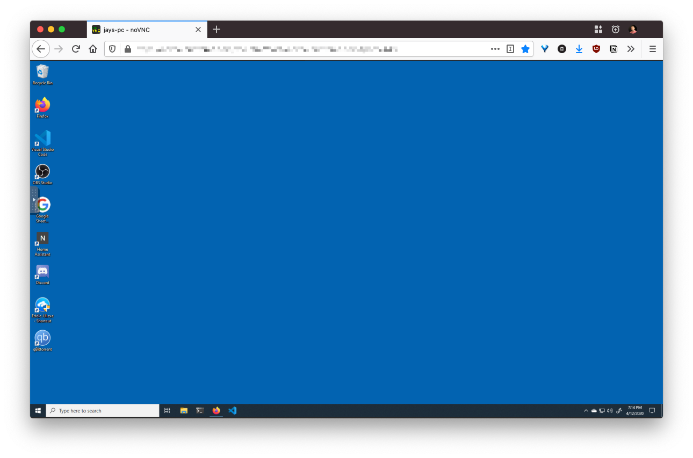

### Introduction

For a handful of reasons, I run a Windows PC at home in headless[^1] mode. I run TightVNC on it so that I can access it graphically. I use [Screens](https://edovia.com/en/screens-ios/) on my iPad, or macOS [Screen Sharing.app](https://support.apple.com/guide/mac-help/share-the-screen-of-another-mac-mh14066/10.15/mac/10.15) to access the PC.

I only use this PC when I'm at home, so at first glance I don't really need an internet-based remote access solution. However, sometimes the client I'm connecting from is connected to a VPN. For example, I frequently am using my work computer, connected to the corporate VPN, when I need/want to do something on my PC.

Since the VPNs in question don't split-tunnel, I must drop the connection. Then connect to the PC directly via my LAN. Then do the thing. Then re-connect to the VPN.

So, after a few weeks of doing that, I became sick of it. To make my VNC accessible from the web, I decided to spin up an instance of [noVNC](https://novnc.com/info.html) on my k8s cluster.

### About the K8s Cluster

The cluster is nothing special. In fact, it's not even a cluster... it's just a single VM running [MicroK8s](https://microk8s.io/). My VM is running on a 2.3Ghz Xeon Proxmox host, with 2 vCPUs and 5Gi RAM.

### About noVNC

noVNC is a project that you may have encountered embedded [in other projects](https://github.com/novnc/noVNC/wiki/Projects-and-companies-using-noVNC). For example, Proxmox VE uses noVNC to show VM consoles. It uses WebSockets and Canvas to make an HTML5 VNC viewer.

There's a standalone version, i.e. one that does not need to be integrated into other software. We can run a containerized noVNC instance that connects to the VNC server running on our Windows PC.

Some people also use noVNC to access graphical applications running in containers. To be clear, that's not what's happening here. The system we are accessing is not a Docker container, but a hardware PC.

### Installing noVNC in Kubernetes

1. **Prepare the namespace**

   Give your novnc deployment its own namespace to live in.

    ```yml
    # novnc-namespace.yml
    apiVersion: v1
    kind: Namespace
    metadata:
    name: novnc
    ```
  
2. **Configure the deployment**

    Configure novnc container to run as a deployment on the K8s cluster.

    ```yml
    # novnc-deployment.yml
    kind: Deployment
    apiVersion: apps/v1
    metadata:
      namespace: novnc
      name: novnc
      labels:
        app: novnc

    spec:
      replicas: 1
      selector:
        matchLabels:
          app: novnc
      template:
        metadata:
          labels:
            app: novnc
        spec:
          containers:
            - image: jhankins/docker-novnc:latest
              imagePullPolicy: IfNotPresent
              name: novnc
              args:
                - --vnc
                - jays-pc.nutt.local:5900
              ports:
                - name: novnc
                  containerPort: 6080
          restartPolicy: Always
    ```

3. **Expose the service**

    Exposing the service allows you to access the service from outside the cluster.

    Note that I'm using [Traefik](https://containo.us/traefik/) `IngressRoute` resources to manage the ingress for the service. I'll explain my Traefik setup in a later post, but note that you'll need a LoadBalancer active to use the service as-is. I recommend [MetalLB](https://metallb.universe.tf/) if you're running at home.

    ```yml
    # novnc-service.yml
    apiVersion: v1
    kind: Service
    metadata:
    name: novnc
    namespace: novnc
    spec:
    type: LoadBalancer
    ports:
        - protocol: TCP
          name: novnc
          port: 6080
    selector:
        app: novnc
    ---
    apiVersion: traefik.containo.us/v1alpha1
    kind: IngressRoute
    metadata:
    name: novnc
    spec:
    entryPoints:
        - websecure
    routes:
        - match: Host(`your-hostname.here`)
          kind: Rule
          services:
              - name: novnc
                port: 6080
    tls:
        certResolver: le
    ```



### Next Steps

We've accomplished what we set out to do— provide a web-based VNC viewer for a PC on our LAN.

Clearly, there are better things to be done here when it comes to securing the application and making the Kubernetes resources more templated (e.g. use environment variables for the `$VNC_HOST`, etc.). I also plan on trying [geek1011/easy-novnc](https://github.com/geek1011/easy-novnc) since it has some additional features that would make this setup even better.


[^1]: Headless mode generally means the system doesn't have a monitor connected.
