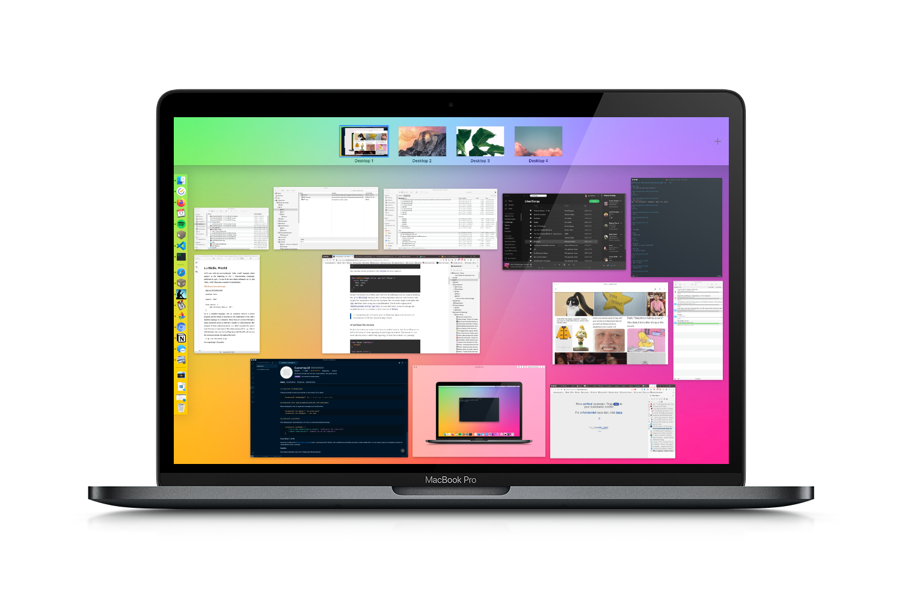
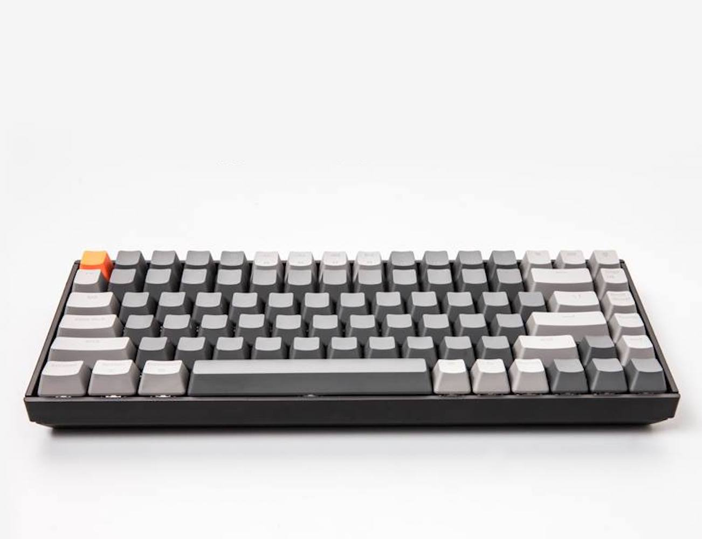
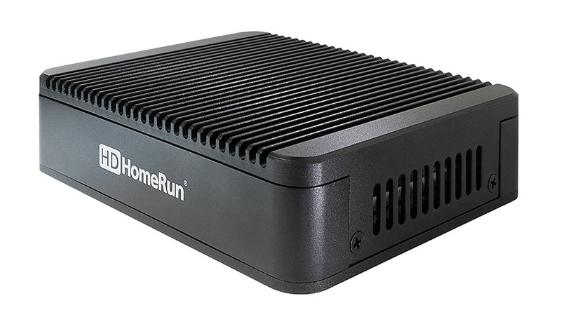
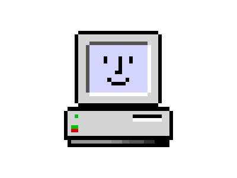

<figure>

   </img>

  <!-- <figcaption>My personal computer is a 15" MacBook Pro from 2016.</figcaption> -->

</figure>

This page catalogs the hardware and software that I use on a daily basis.

I love learning about how people use their computers, and similarly love sharing how I use mine. I've created a pretty customized setup over the years, and I'm pretty picky, so this serves as a lowkey review page for the apps and products I use.

You may be familiar with other `/uses` pages. The idea comes from [Wes Bos](https://wesbos.com), and you can view geek out on other people's setups at [wesbos/awesome-uses](https://github.com/wesbos/awesome-uses).

- [Hardware](#hardware)
  - [Keyboard(s)](#keyboards)
  - [Mice](#mice)
  - [MacBook Pro 15", Late 2016](#macbook-pro-15%22-late-2016)
  - [HP Microserver Gen 8](#hp-microserver-gen-8)
  - [HDHomeRun EXTEND](#hdhomerun-extend)
  - [Dell P2715Q](#dell-p2715q)
- [Software](#software)
  - [Apple macOS](#apple-macos)
  - [Plex](#plex)
  - [Firefox](#firefox)
  - [Notion](#notion)
- [Wallpapers](#wallpapers)

## Hardware
Hardware. Pick it up, touch it, swipe it. I like devices that feel premium and have some heft to them. Thin and light is nice, and so is th

### Keyboard(s)

I have accumulated a few external keyboards over the years. The most interesting one, I think, is the **Keychron K2** wireless mechanical keyboard. It's my primary keyboard at home.

If you've been in the mechanical keyboard game for a while, then you may not be impressed by the Keychron K2. Or maybe you would, I don't know. I just picked mine up in early November. I haven't used a mechanical keyboard in years, probably since my IBM Aptiva days.

So far, I'm just getting used to it. It is the white LED, brown switch model. I love the orange escape key, even though I have been using the CapsLock key for Esc for about a year now. (More on my Hyper key setup later.)

### Mice
  Not only mice

### MacBook Pro 15", Late 2016

This is my primary personal computer.

### HP Microserver Gen 8

This server runs Proxmox and a number of virtual machines.

### HDHomeRun EXTEND

The HDHomeRun EXTEND is a digital TV tuner that allows me to tune over-the-air TV channels on my Plex DVR. It has a nice built-in transcoder to help ease CPU usage on the Plex server.

### Dell P2715Q

## Software

### Apple macOS
Mojave

### Plex

### Firefox

I have a highly-customzied setup with Firefox. It deserves its own article, and it has one.

### Notion

Notion is *amazing*.

## Wallpapers

Over the years, I've collected so many wallpapers, it's probably a bit ridiculous. I prune my wallpaper folders and albums every so often, but my collection is still... *extensive*. There's something so delightful about finding a wallpaper that looks good on your device, even in the moment, and storage is so cheap, why not save it?

three
eleven
one
two
